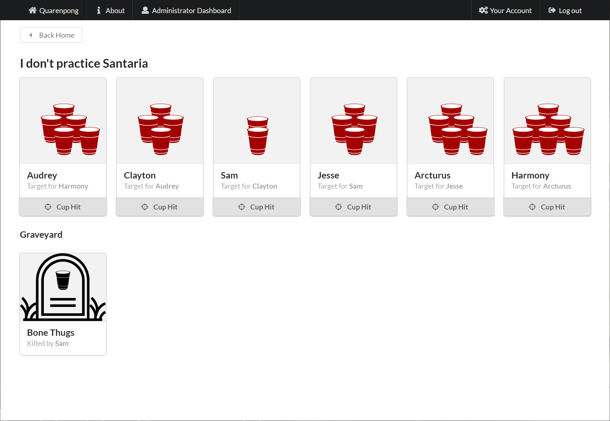

Round-table beirut app based on the [Flask-Base](https://github.com/hack4impact/flask-base/) template kindly made available by hack4impact.

## Demos

Gameplay:




Response Mobile Design::


## Setting up

##### Initialize a virtual environment

Windows:
```
$ python3 -m venv venv
$ venv\Scripts\activate.bat
```

Unix/MacOS:
```
$ python3 -m venv venv
$ source venv/bin/activate
```
Learn more in [the documentation](https://docs.python.org/3/library/venv.html#creating-virtual-environments).

Note: if you are using a python before 3.3, it doesn't come with venv. Install [virtualenv](https://docs.python-guide.org/dev/virtualenvs/#lower-level-virtualenv) with pip instead.

##### (If you're on a Mac) Make sure xcode tools are installed

```
$ xcode-select --install
```

##### Add Environment Variables

Create a file called `config.env` that contains environment variables. **Very important: do not include the `config.env` file in any commits. This should remain private.** You will manually maintain this file locally, and keep it in sync on your host.

Variables declared in file have the following format: `ENVIRONMENT_VARIABLE=value`. You may also wrap values in double quotes like `ENVIRONMENT_VARIABLE="value with spaces"`.

1. In order for Flask to run, there must be a `SECRET_KEY` variable declared. Generating one is simple with Python 3:

   ```
   $ python3 -c "import secrets; print(secrets.token_hex(16))"
   ```

   This will give you a 32-character string. Copy this string and add it to your `config.env`:

   ```
   SECRET_KEY=Generated_Random_String
   ```

2. The mailing environment variables can be set as the following.
   We recommend using [Sendgrid](https://sendgrid.com) for a mailing SMTP server, but anything else will work as well.

   ```
   MAIL_USERNAME=SendgridUsername
   MAIL_PASSWORD=SendgridPassword
   ```

Other useful variables include:

| Variable        | Default   | Discussion  |
| --------------- |-------------| -----|
| `ADMIN_EMAIL`   | `flask-base-admin@example.com` | email for your first admin account |
| `ADMIN_PASSWORD`| `password`                     | password for your first admin account |
| `DATABASE_URL`  | `data-dev.sqlite`              | Database URL. Can be Postgres, sqlite, etc. |
| `REDISTOGO_URL` | `http://localhost:6379`        | [Redis To Go](https://redistogo.com) URL or any redis server url |
| `RAYGUN_APIKEY` | `None`                         | API key for [Raygun](https://raygun.com/raygun-providers/python), a crash and performance monitoring service |
| `FLASK_CONFIG`  | `default`                      | can be `development`, `production`, `default`, `heroku`, `unix`, or `testing`. Most of the time you will use `development` or `production`. |


##### Install the dependencies

```
$ pip install -r requirements.txt
```

##### Other dependencies for running locally

You need [Redis](http://redis.io/), and [Sass](http://sass-lang.com/). Chances are, these commands will work:


**Sass:**

```
$ gem install sass
```

**Redis:**

_Mac (using [homebrew](http://brew.sh/)):_

```
$ brew install redis
```

_Linux:_

```
$ sudo apt-get install redis-server
```

You will also need to install **PostgresQL**

_Mac (using homebrew):_

```
brew install postgresql
```

_Linux (based on this [issue](https://github.com/hack4impact/flask-base/issues/96)):_

```
sudo apt-get install libpq-dev
```


##### Create the database

```
$ python manage.py recreate_db
```

##### Other setup (e.g. creating roles in database)

```
$ python manage.py setup_dev
```

Note that this will create an admin user with email and password specified by the `ADMIN_EMAIL` and `ADMIN_PASSWORD` config variables. If not specified, they are both `flask-base-admin@example.com` and `password` respectively.

## Running the app

```
$ source env/bin/activate
$ honcho start -e config.env -f Local
```

For Windows users having issues with binding to a redis port locally, refer to [this issue](https://github.com/hack4impact/flask-base/issues/132).

## Formatting code

Before you submit changes to flask-base, you may want to autoformat your code with `python manage.py format`.


## Contributing

Contributions are welcome! Please refer to our [Code of Conduct](./CONDUCT.md) for more information.

## License
[MIT License](LICENSE.md)
